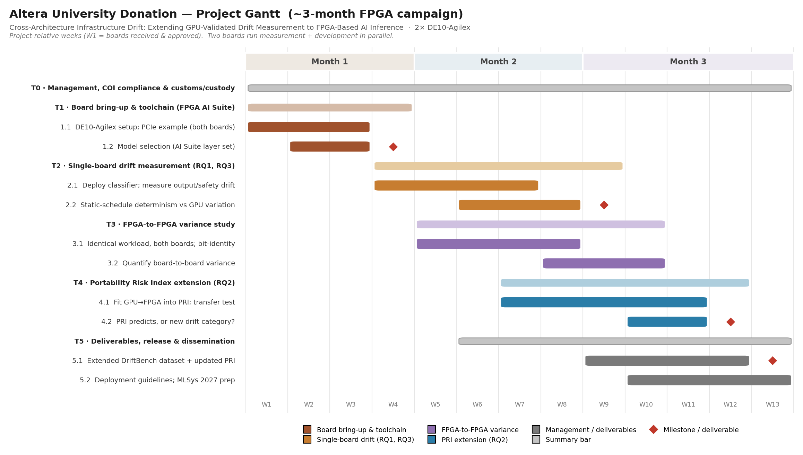

# Altera Donation Request UPR-11559 — Supporting Materials

Supporting documents for an Altera University Program hardware donation request (2 × DE10-Agilex, University of Palermo). The donation form has no file-upload field, so the two files it references live here.

## Files

- **`Altera_University_Donation_Request.pdf`** — the full donation request. Contains the completed form entries (intended use, board selection, quantity, shipping, and applicant/PI details) and the research proposal behind it: objectives, the three research questions, scope, hardware justification, and deliverables.

- **`Altera_Donation_Gantt.xlsx`** — the project Gantt chart: the development and delivery timeline, breaking the work into phases and tasks with their scheduling across the ~3-month campaign. Rendered below.

## Timeline

